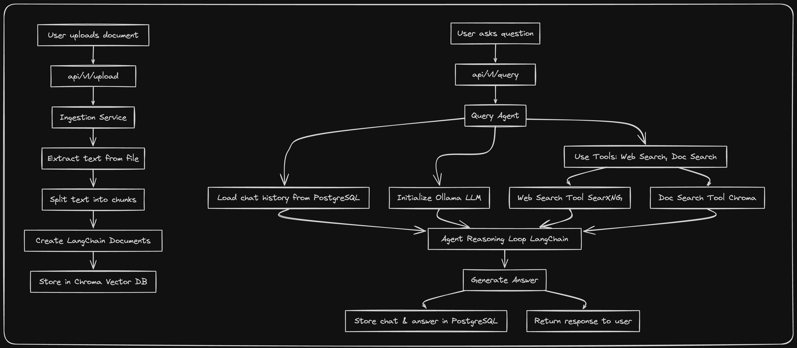

# Curiositi 🧠

Curiositi is an AI-powered assistant that delivers precise, context-aware answers by combining user documents with live web data. It implements a hybrid Retrieval-Augmented Generation (RAG) system to help you find and synthesize information across your files, and the internet.

---

## 🔍 What Curiositi Does

1. **Document Ingestion**

   - Upload files via the API.
   - Automatically extract, split, and embed your documents into a vector store for fast similarity search.

2. **Query Handling**

   - Clients send natural-language questions to `/api/v1/query`.
   - The agent selects a strategy:
     - **Direct**: answer immediately using the LLM's knowledge.
     - **Retrieve**: generate sub-queries against uploaded docs and web (via SearXNG).

3. **Context Retrieval**

   - **Document Search**: similarity search in ChromaDB returns top-scoring chunks.
   - **Web Search**: SearXNG tool fetches external results.

4. **Answer Synthesis**
   - Retrieved results are combined and fed back into the LLM.
   - The final answer is synthesized with citations and returned alongside metadata.



---

## 🚀 Key Features

- **Easy Upload**: Just POST your files; ingestion is fully automated.
- **Scalable Vector Store**: Powered by ChromaDB for lightning-fast similarity search.
- **Dual-Source RAG**: Seamlessly combine internal document search with external web search.
- **Configurable LLMs**: Choose Ollama or OpenAI models and fine-tune your temperature.
- **Type-Safe API**: Input validation with Zod ensures robust, predictable behavior.
- **Transparent Metadata**: Trace every sub-query and see exactly which sources informed the answer.

---

## 🏃‍♂️ Getting Started

To get a more detailed step-by-step process of setting up Curiositi, take a look at the [getting started doc](./docs/getting-started.md)

### 1. Clone & Install

````bash
# 1. Clone the repo and enter server directory
git clone https://github.com/macintushar/curiositi.git
cd curiositi/server

# 2. Install dependencies with Bun
bun install

### 2. Configure

Copy the environment template and edit your service URLs and credentials:

```bash
cp .env.example .env
# Edit .env: CHROMA_URL, OLLAMA_BASE_URL, DATABASE_URL, OPENROUTER_API_KEY, SEARXNG_URL

# 4. Start the server (dev vs prod)
bun run dev    # development (hot reload)
bun run start  # production
````

The API listens by default on `http://localhost:3030`.

---

## Project Layout

```
curiositi/
├─ .github/               # CI/CD workflows
├─ docs/                  # Flow diagrams (curiositi-flow.png) & PRD (PRD.md)
├─ server/                # Bun + Hono backend (API & agent)
├─ LICENSE                # Elastic License v2
└─ README.md              # This overview (you are here)
```

---

## Contributing & License

Contributions are welcome! Please review the [contribution guidelines](CONTRIBUTING.md) before submitting issues or pull requests.

---

## 💼 License

Curiositi is licensed under the Elastic License v2. See [LICENSE](LICENSE).
