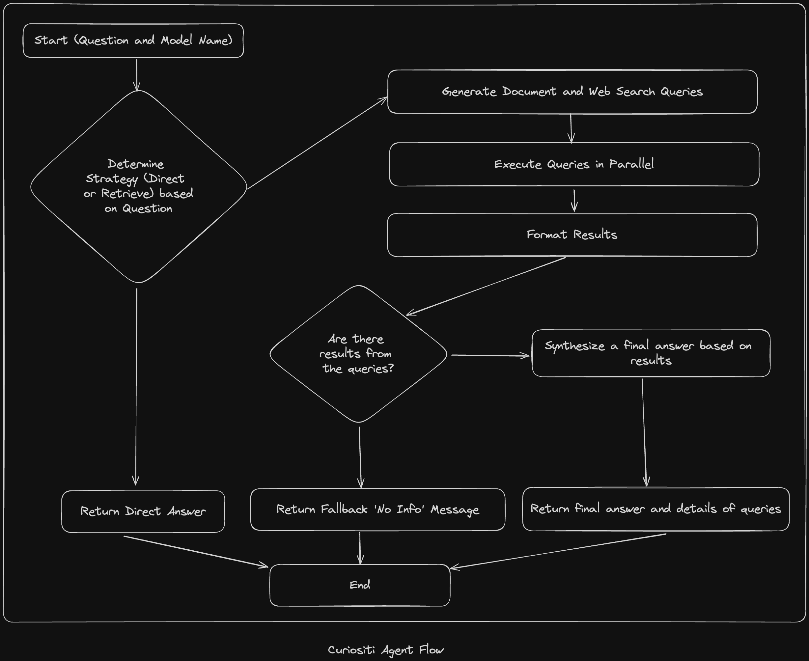

<p align="center">
   
</p>

# Curiositi

Curiositi is an AI-powered assistant that delivers precise, context-aware answers by combining user documents with live web data. It implements a hybrid Retrieval-Augmented Generation (RAG) system to help you find and synthesize information across your files and the internet.

## 🔍 What Curiositi Does

1. **Knowledge Spaces**

   - Create and manage topic-based spaces for your documents
   - Organize information in a structured way
   - Associate conversation threads with specific spaces

2. **Document Management**

   - Upload multiple file types (PDF, text, CSV, markdown, etc.)
   - Automatic extraction, chunking, and embedding generation
   - Document retrieval and metadata tracking

3. **AI-Powered Search**

   - Vector-based similarity search across your documents
   - Space-specific or general search capabilities
   - Support for multiple embedding model providers

4. **Conversational Interface**

   - Thread-based conversation history
   - Context-aware responses using document context and web search
   - Long-term memory for more relevant interactions

5. **Web Search Integration**
   - SearXNG integration for up-to-date information
   - Combines web results with your document knowledge
   - Provides comprehensive answers with citations



## 🚀 Key Features

- **User Authentication**: Complete authentication flow with session management
- **Knowledge Spaces**: Organize documents in topic-based collections
- **Multi-Provider Support**: Choose between Ollama, OpenAI, or OpenRouter models
- **PostgreSQL Vector Storage**: Native vector capabilities for fast similarity search
- **RESTful API**: Comprehensive endpoints for all system functionality
- **Thread Management**: Organize conversations and maintain context
- **Docker Support**: Easy deployment with containerization
- **Modern Web Interface**: Clean, responsive UI built with Next.js

## 🏃‍♂️ Getting Started

For a more detailed step-by-step process of setting up Curiositi, take a look at the [getting started doc](./docs/getting-started.md)

### 1. Clone & Install

```bash
# 1. Clone the repo
git clone https://github.com/macintushar/curiositi.git
cd curiositi
```

### 2. Server Setup

```bash
# Navigate to server directory
cd server

# Install dependencies with Bun
bun install

# Configure environment variables
cp .env.example .env
# Edit .env with your database, Ollama, and other service configurations
```

### 3. Database Setup

```bash
# Generate database schema
bun run db:generate

# Run migrations
bun run db:migrate
```

### 4. Web Client Setup

```bash
# Navigate to web client directory
cd ../clients/web

# Install dependencies
bun install

# Configure environment
cp .env.example .env
# Edit .env with your server URL and other configurations
```

### 5. Start the Services

```bash
# Start the server (development mode with hot reload)
cd ../../server
bun run dev

# In a separate terminal, start the web client
cd ../clients/web
bun run dev
```

Access the web interface at `http://localhost:3040` and the API at `http://localhost:3030`

## Project Layout

```
curiositi/
├─ .github/              # CI/CD workflows
├─ clients/
│  ├─ web/               # Next.js web interface
├─ server/               # Bun + Hono backend with API
│  ├─ src/               # Server source code
│  │  ├─ agents/         # AI agent implementation
│  │  ├─ db/             # Database schemas and connection
│  │  ├─ routes/         # API endpoints
│  │  ├─ services/       # Core service implementations
│  │  ├─ tools/          # Utility functions and tools
├─ docs/                 # Documentation and guides
├─ LICENSE               # Elastic License v2
```

## Contributing & License

Contributions are welcome! Please review the [contribution guidelines](docs/CONTRIBUTING.md) before submitting issues or pull requests.

Curiositi is licensed under the Elastic License v2. See [LICENSE](LICENSE.md).
