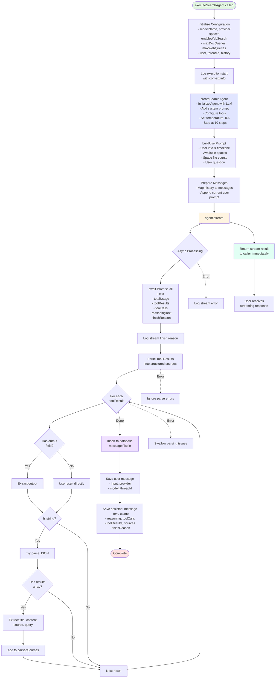

# Search Agent Flow Diagram

This diagram describes how the search-agent.ts works.

## Key Components

### 1. Initialization (lines 124-148)
Configuration setup including model, provider, spaces, and search settings with detailed logging.

### 2. Agent Creation (lines 106-121)
Creates an AI agent with:
- LLM model and provider
- System prompt defining search behavior
- Tool configuration (document search, web search)
- Temperature: 0.6
- Max steps: 10

### 3. Prompt Building (lines 81-104)
Constructs user prompt with:
- User information and timezone
- Available document spaces
- Space metadata (file counts, descriptions)
- User's question

### 4. Message Preparation (lines 167-173)
Formats conversation history and appends current user prompt.

### 5. Streaming (lines 179, 269)
Returns immediate stream to caller for real-time response delivery.

### 6. Async Processing (lines 181-267)
Background processing that:
- Awaits all stream results in parallel (text, usage, tool results, etc.)
- Parses tool results into structured sources
- Handles JSON parsing with error resilience
- Saves both user and assistant messages to database

## Notable Features

- **System Prompt**: Defines when to use search tools, citation format, and search strategy (lines 34-79)
- **Dual Search**: Supports both document search and web search tools
- **Streaming Response**: Results are streamed to users immediately while processing continues
- **Error Handling**: Robust error handling that swallows parsing errors to prevent failures
- **Source Tracking**: Extracts and stores citations from tool results for reference tracking
- **Database Persistence**: Saves complete conversation history with metadata
