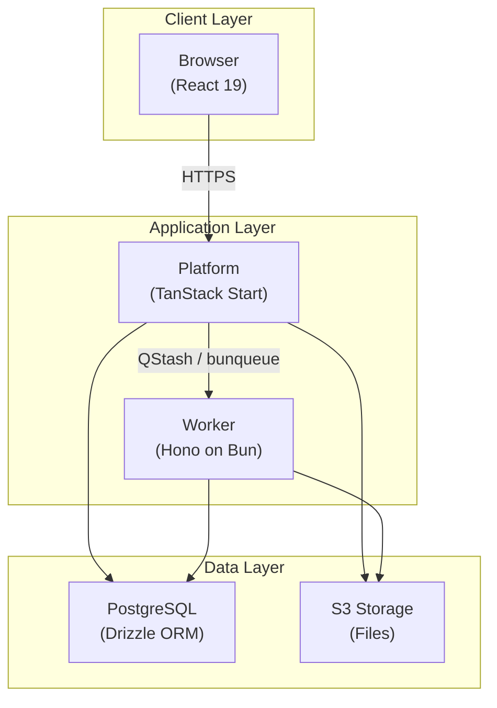
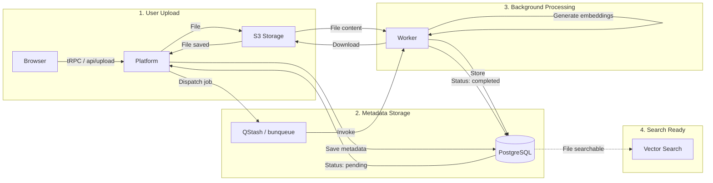
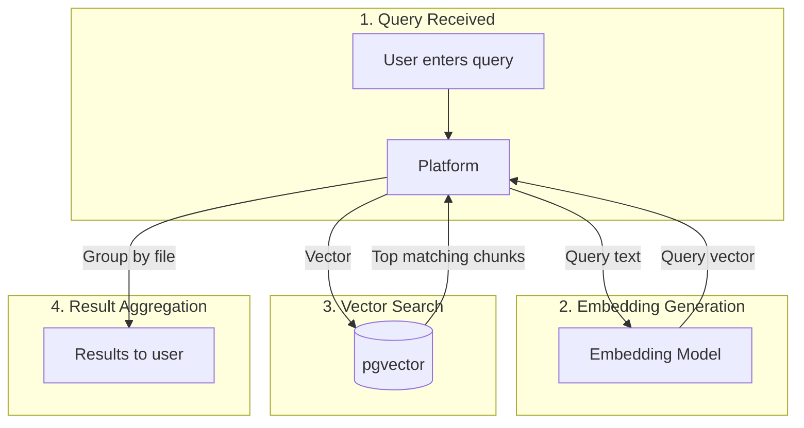
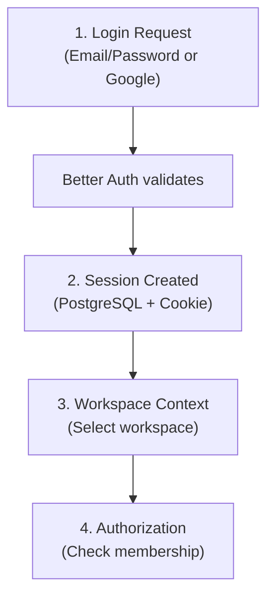
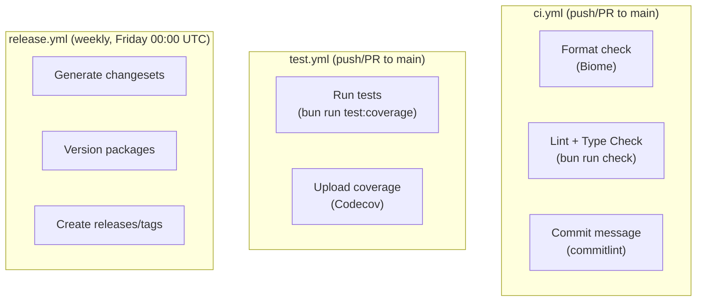

Curiositi is a monorepo built with Turborepo and Bun. This document explains the system architecture, data flow, and technical decisions.

## High-Level Architecture



## Component Overview

### Platform (Web Application)

**Technology Stack:**
- **Framework:** React 19 + TanStack Start
- **Routing:** TanStack Router (file-based)
- **Data Fetching:** TanStack Query + tRPC v11
- **API:** tRPC for type-safe client-server communication
- **Styling:** Tailwind CSS v4 + shadcn/ui
- **Build Tool:** Vite 7 with Nitro for SSR
- **Auth:** Better Auth (Google OAuth + email/password)
- **Monitoring:** Sentry

**Key Directories:**
```
apps/platform/src/
├── routes/           # TanStack Router route definitions
├── components/       # React components
│   └── ui/          # shadcn/ui components
├── pages/           # Page-level views
├── layouts/         # Layout components
├── integrations/    # tRPC client and server setup
├── hooks/           # React hooks
├── lib/             # Utilities (auth, upload, etc.)
├── middleware/      # Server middleware
└── env.ts           # Environment variable validation
```

### Worker (File Processing)

The worker is a Hono server running on Bun that processes uploaded files. It exposes the following endpoints:

| Endpoint | Method | Description |
|----------|--------|-------------|
| `/` | GET | Root health check |
| `/health` | GET | Health status endpoint |
| `/process-file` | POST | File processing endpoint (invoked by QStash/bunqueue) |

The `POST /process-file` endpoint is invoked by the platform via Upstash QStash or bunqueue (for local development).

**Technology Stack:**
- **Framework:** Hono
- **Runtime:** Bun (port 3040)
- **AI:** Vercel AI SDK (`ai` package) with OpenAI and Google providers
- **Queue:** Upstash QStash (production) or bunqueue (local development)

**Key Directories:**
```
apps/worker/src/
├── processors/      # File type processors
│   ├── doc.ts      # Document processor (PDF, text, etc.)
│   ├── image.ts    # Image processor (JPEG, PNG, etc.)
│   └── types.ts    # Processor type definitions
├── lib/
│   ├── chunk.ts    # Text chunking (800 tokens, 100 overlap)
│   └── md.ts       # Markdown utilities
├── process-file.ts # Main file processing logic
├── index.ts        # Hono server entry point
└── env.ts          # Environment variable validation
```

### Database (PostgreSQL + pgvector)

**Technology Stack:**
- **Database:** PostgreSQL 14+ with pgvector extension
- **ORM:** Drizzle ORM
- **Migrations:** Drizzle Kit

**Key Tables:**
```
Better Auth Tables:
├── user
├── session
├── account
├── organization
├── member
└── verification

Curiositi Tables:
├── spaces           # Hierarchical spaces (parentSpaceId for nesting)
├── files            # File metadata (name, type, size, S3 key, status)
├── fileContents     # Extracted content chunks + vector embeddings (1536d)
└── filesInSpace     # Many-to-many junction table
```

### Shared Packages

```
packages/
├── db/              # Database schema and Drizzle config
│   └── src/
│       ├── schema.ts   # All table definitions
│       ├── client.ts   # Database client
│       └── index.ts    # Exports
├── share/           # Shared utilities
│   └── src/
│       ├── ai/         # AI model definitions (OpenAI, Google)
│       ├── constants/  # MIME types, file size limits, allowed types
│       ├── fs/         # File system helpers
│       ├── logger/     # Structured logging utility
│       ├── schemas/    # Shared Zod schemas
│       └── types/      # Shared type definitions
├── api-handlers/    # Shared API handler logic
│   └── src/
│       ├── upload.ts   # File upload handling
│       ├── file.ts     # File operations
│       ├── space.ts    # Space operations
│       ├── queue.ts    # Queue job dispatching
│       └── response.ts # Response helpers
├── queue/           # Job queue wrapper (supports QStash and bunqueue)
└── tsconfig/        # Shared TypeScript configurations
```

## Data Flow

### File Upload Flow



### Search Flow



### Authentication Flow



## Technical Decisions

### Why Turborepo?

- **Code Sharing** — Shared packages (db, share, api-handlers, queue) reduce duplication
- **Build Optimization** — Turborepo caches and parallelizes builds
- **Unified Tooling** — Single lint (Biome), format, and type-check across the repo
- **Dependency Management** — Workspace protocol for internal dependencies

### Why TanStack Start?

- **File-based Routing** — Automatic route generation via TanStack Router
- **Type Safety** — End-to-end TypeScript with tRPC integration
- **SSR Support** — Built-in server-side rendering via Vite + Nitro
- **Developer Experience** — Hot reload and excellent dev tools

### Why Hono for Worker?

- **Performance** — Lightweight and fast, runs natively on Bun
- **Simplicity** — Single endpoint, minimal framework overhead
- **TypeScript Native** — Full type safety out of the box

### Why Drizzle ORM?

- **Type Safety** — Full TypeScript support with inferred types
- **SQL-like Syntax** — Familiar query building, close to raw SQL
- **Migration Support** — Drizzle Kit for schema generation and migrations
- **Performance** — Minimal overhead compared to heavier ORMs

### Why pgvector?

- **Native Integration** — Vector storage directly in PostgreSQL
- **Similarity Search** — Efficient nearest neighbor queries
- **No Additional Services** — No need for a separate vector database
- **ACID Compliance** — Transactional safety for embeddings alongside relational data

## Monitoring and Observability

### Logging

- **Structured Logging** — Custom logger in `packages/share/src/logger/`
- **Log Levels** — Debug, Info, Warn, Error

### Error Tracking

- **Sentry** — Integrated into the platform for error tracking and performance monitoring

## CI/CD

### GitHub Actions Workflows



### Deployment

- **Platform** — Deploys to Vercel (TanStack Start + Nitro)
- **Documentation (www)** — Deploys to Vercel (Starlight + Astro)
- **Worker** — Runs on Bun

## Development

### Local Development

```bash
# Start all services
bun run dev

# Services available:
# - Platform: http://localhost:3030
# - Worker:   http://localhost:3040
```

### Testing

The project uses Bun's built-in test runner and Playwright for E2E tests:

```bash
# Run tests with coverage
bun run test

# Run with lcov coverage output
bun run test:coverage
```

## Next Steps

- [Configuration](/docs/development/configuration) — Environment variables and settings
- [Core Concepts](/docs/getting-started/core-concepts) — Understand the data model
- [Getting Started](/docs/getting-started/getting-started) — Run Curiositi locally
