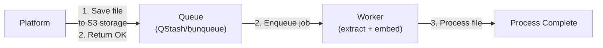

The queueing system handles asynchronous file processing in Curiositi. When a user uploads a file, the platform immediately acknowledges the upload and queues a background job to process the file. This keeps the user experience fast and responsive.

## How It Works



**Flow:**

1. User uploads a file via the Platform
2. Platform saves the file to S3 storage and creates a database record with status `pending`
3. Platform enqueues a processing job via the configured queue provider
4. Queue invokes the Worker at `POST /process-file`
5. Worker downloads the file, extracts content, creates embeddings, and updates the database

## Provider Comparison

| Feature | QStash | bunqueue |
|---------|--------|----------|
| **Hosting** | Cloud (Upstash) | Self-hosted (local) |
| **Cost** | Free tier available | Free (open source) |
| **Setup** | Create account, get token | Run local server |
| **Persistence** | Upstash managed | SQLite database |
| **Use Case** | Production | Local development |
| **Scaling** | Auto-scaling | Single instance |

### When to Use Each

**QStash (Production)**
- Deploying to production
- Need reliable, managed infrastructure
- Want automatic scaling
- Have Upstash account configured

**bunqueue (Development)**
- Local development without cloud services
- Quick prototyping
- Testing queue behavior locally
- No internet connection required

## Setting Up QStash

QStash is the default queue provider and recommended for production deployments.

### 1. Create Upstash Account

Sign up at [upstash.com](https://upstash.com) and create a new QStash project.

### 2. Get Your Token

In the QStash dashboard, copy your authentication token.

### 3. Configure Environment

Add to your `.env` file:

```bash
QUEUE_PROVIDER=qstash
QSTASH_TOKEN="your-qstash-token-here"
QSTASH_URL="https://your-qstash-url.upstash.io"
WORKER_URL="https://your-worker-url.com"
```

### 4. Verify Configuration

QStash is ready when:
- `QUEUE_PROVIDER=qstash`
- `QSTASH_TOKEN` is set
- `WORKER_URL` points to your worker deployment

## Setting Up bunqueue

bunqueue is a lightweight queue built on Bun, ideal for local development.

### 1. Start the bunqueue Server

```bash
# Using the queue package dev script
cd packages/queue && bun run dev

# Or run directly with bunx
bunx bunqueue start --port 6789 --data-path ./queue.db
```

The server runs on `localhost:6789` by default.

### 2. Configure Environment

Add to your `.env` file:

```bash
QUEUE_PROVIDER=local
BUNQUEUE_URL=localhost:6789
```

### 3. Ignore Database Files

Add to `.gitignore`:

```
queue.db
queue.db-shm
queue.db-wal
```

The SQLite database stores jobs locally. Each developer has their own queue state.

## Switching Providers

To switch between providers, update `QUEUE_PROVIDER` in your `.env`:

```bash
# For QStash (production)
QUEUE_PROVIDER=qstash
QSTASH_TOKEN="your-token"

# For bunqueue (local)
QUEUE_PROVIDER=local
BUNQUEUE_URL=localhost:6789
```

Restart both platform and worker after changing the provider.

## Configuration Reference

| Variable | Provider | Required | Default | Description |
|----------|----------|----------|---------|-------------|
| `QUEUE_PROVIDER` | Both | No | `qstash` | Queue provider: `qstash` or `local` |
| `QSTASH_TOKEN` | qstash | Conditional | - | Upstash QStash authentication token |
| `QSTASH_URL` | qstash | No | Upstash default | Custom QStash endpoint URL |
| `WORKER_URL` | qstash | Yes | - | Public URL of the worker service |
| `BUNQUEUE_URL` | local | Conditional | `localhost:6789` | bunqueue server URL |

## Troubleshooting

### Jobs Not Processing

**Symptoms:** Files remain in "pending" status indefinitely.

**Solutions:**

1. Check queue provider is running:
   ```bash
   # For bunqueue
   curl http://localhost:6789/health
   ```

2. Verify environment variables are set correctly:
   ```bash
   echo $QUEUE_PROVIDER
   echo $QSTASH_TOKEN   # or $BUNQUEUE_URL
   ```

3. Check worker logs for processing errors:
   ```bash
   bun --filter @curiositi/worker dev
   ```

4. For QStash, verify the token is valid in the Upstash dashboard

### Connection Refused (bunqueue)

**Symptoms:** `ECONNREFUSED` error when enqueueing jobs.

**Solutions:**

1. Ensure bunqueue server is running:
   ```bash
   cd packages/queue && bun run dev
   ```

2. Verify the port matches:
   ```bash
   # Check BUNQUEUE_URL matches the server port
   echo $BUNQUEUE_URL
   ```

3. Try a different port if 6789 is in use:
   ```bash
   bunx bunqueue start --port 6790
   # Update BUNQUEUE_URL=localhost:6790
   ```

### Invalid Token (QStash)

**Symptoms:** `401 Unauthorized` or `invalid token` errors.

**Solutions:**

1. Regenerate token in Upstash dashboard
2. Update `QSTASH_TOKEN` in your `.env`
3. Restart the platform application

### Worker Not Receiving Jobs

**Symptoms:** Jobs appear in queue but worker never processes them.

**Solutions:**

1. Verify `WORKER_URL` is publicly accessible (for QStash)
2. For local testing with QStash, use a tunnel:
   ```bash
   npx cloudflared tunnel --url http://localhost:3040
   # Use the tunnel URL as WORKER_URL
   ```
3. Check worker is running:
   ```bash
   curl http://localhost:3040/process-file
   # Should return 400 (bad request) not 404
   ```

### Debug Mode

Enable verbose logging to debug queue operations:

```bash
# In your .env
DEBUG=*
```

Check platform logs for:
- `Enqueued job processFile` — job was sent to queue
- `Failed to enqueue job` — error occurred

## Architecture

For a deeper understanding of how the queue fits into the system, see:

- [Architecture Overview](/docs/development/architecture) — High-level system design
- [Configuration](/docs/development/configuration) — Environment variable reference
