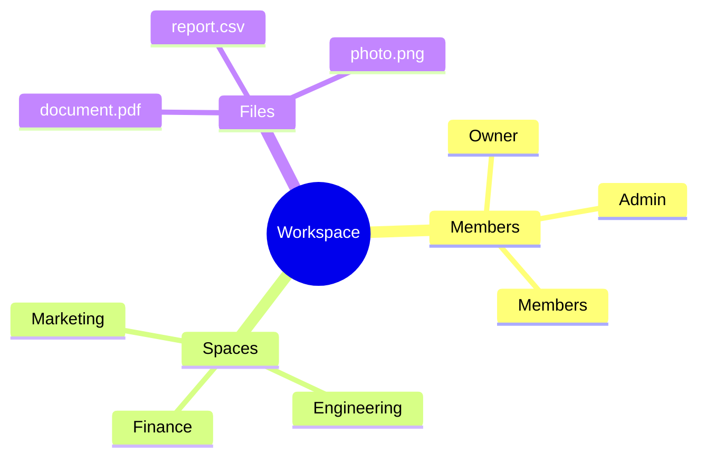
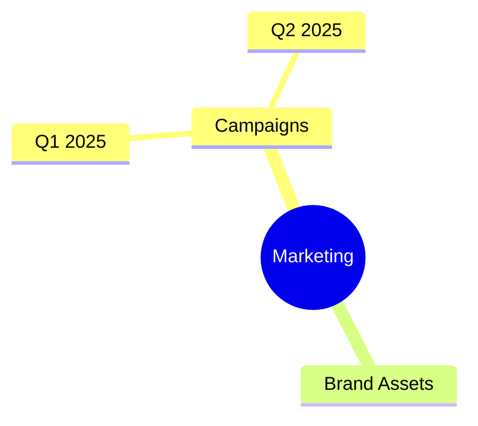
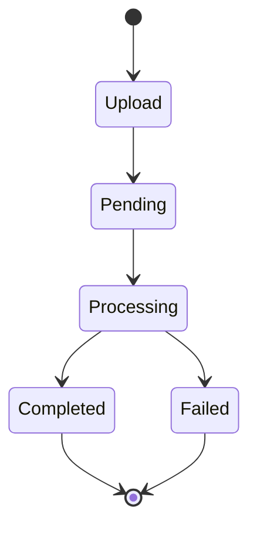
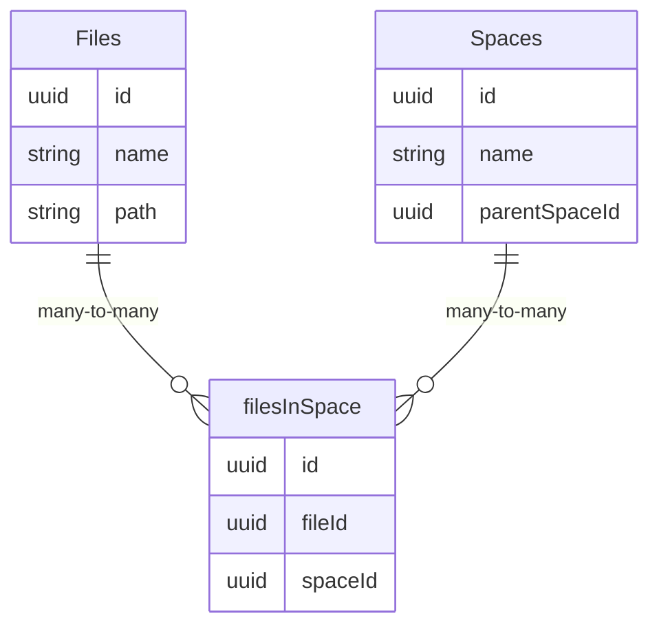
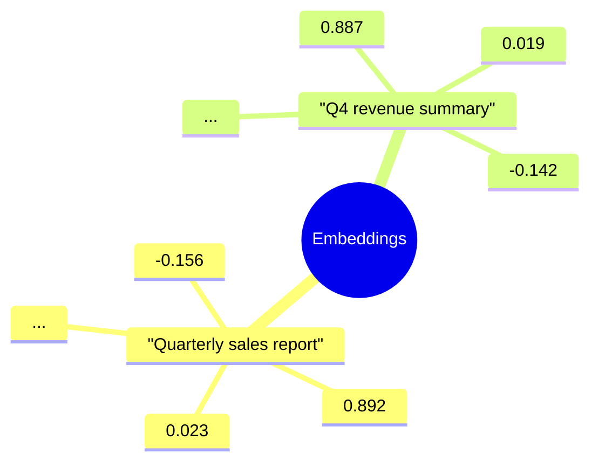
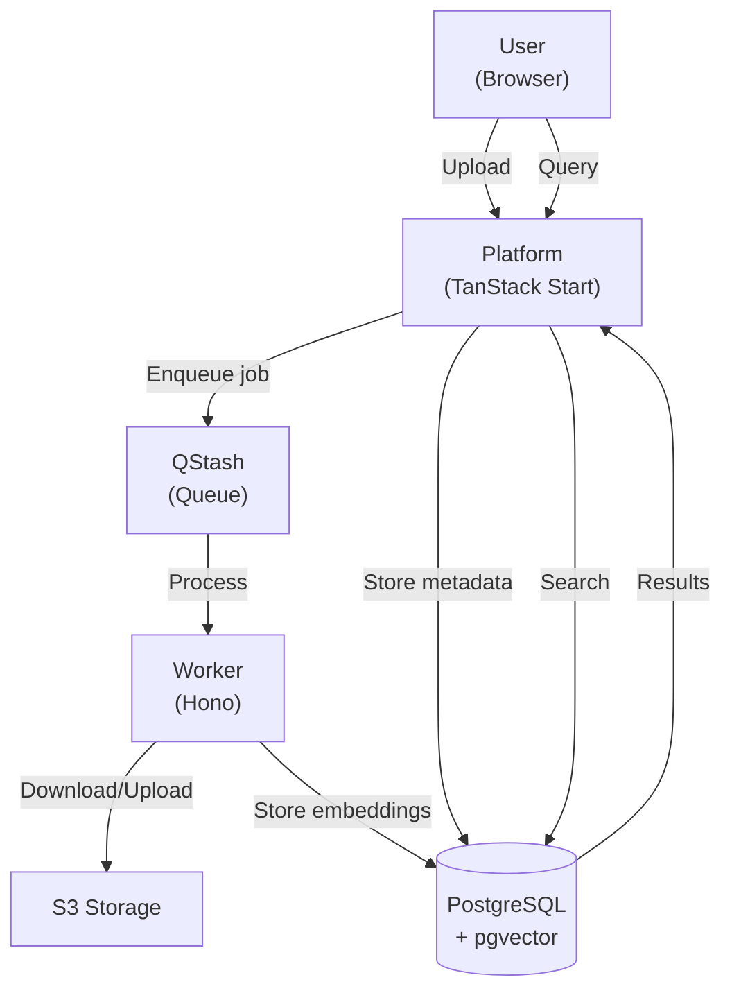

Understanding Curiositi's core concepts will help you make the most of the platform.

## Workspaces

Workspaces are the top-level containers in Curiositi. They represent teams or companies.

### Key Features

- **Multi-tenancy** — Each workspace is completely isolated
- **Member Management** — Invite users with different roles (owner, admin, member)
- **Session Scoping** — Users select an active workspace, and all queries are scoped to it

### Workspace Structure

### Workspace Data Model

Workspaces are stored as `organization` records in the database (via Better Auth):

| Field | Type | Description |
|-------|------|-------------|
| `id` | text | Primary key |
| `name` | text | Workspace name |
| `slug` | text | URL-friendly identifier (unique) |
| `logo` | text | Optional logo URL |
| `metadata` | text | Optional metadata |
| `createdAt` | timestamp | Creation time |

## Spaces

Spaces are Curiositi's way of organizing content. They work like folders with hierarchical nesting.

### Space Hierarchy

Spaces can be nested using the `parentSpaceId` field:

### Space Data Model

| Field | Type | Description |
|-------|------|-------------|
| `id` | UUID | Primary key (auto-generated) |
| `name` | text | Display name |
| `description` | text | Optional description |
| `icon` | text | Optional icon (e.g., emoji) |
| `organizationId` | text | Owning workspace |
| `parentSpaceId` | UUID / null | Parent space reference for nesting |
| `createdAt` | timestamp | Creation time |
| `updatedAt` | timestamp | Last modification time |

### Spaces vs Traditional Folders

| Feature | Traditional Folders | Curiositi Spaces |
|---------|---------------------|------------------|
| Nesting | Limited depth | Unlimited hierarchy |
| Search | Filename only | Semantic search across all content |
| File location | Files in one folder | Files can be in multiple spaces |
| Organization scope | Per-user | Per-workspace |

## Files

Files are the core content in Curiositi. Each file goes through a processing pipeline from upload to searchable content.

### File Lifecycle

### File Statuses

| Status | Description |
|--------|-------------|
| `pending` | File uploaded, waiting for worker to process |
| `processing` | Worker is extracting content and generating embeddings |
| `completed` | File is fully processed and searchable |
| `failed` | Processing encountered an error |

### File Data Model

| Field | Type | Description |
|-------|------|-------------|
| `id` | UUID | Primary key (auto-generated) |
| `name` | text | Original filename |
| `path` | text | S3 storage path |
| `size` | integer | File size in bytes |
| `type` | text | MIME type |
| `organizationId` | text | Owning workspace |
| `uploadedById` | text | User who uploaded the file |
| `status` | enum | `pending`, `processing`, `completed`, `failed` |
| `tags` | jsonb | Optional tags (default: `{ tags: [] }`) |
| `processedAt` | timestamp | When processing completed |
| `createdAt` | timestamp | Upload time |
| `updatedAt` | timestamp | Last modification time |

### File Processing Pipeline

When a file is uploaded:

1. **Upload** — File streams to S3 storage
2. **Metadata** — File record created in database with status `pending`
3. **Queue** — Processing job dispatched via Upstash QStash
4. **Content Extraction** — Worker extracts text (documents) or generates descriptions (images)
5. **Chunking** — Content split into chunks (800 tokens, 100 token overlap)
6. **Embedding** — Each chunk converted to a 1536-dimension vector
7. **Storage** — Chunks and embeddings saved to `fileContents` table
8. **Complete** — File status updated to `completed`

## Content Chunks

Files are broken into chunks for precise semantic search.

### Why Chunking?

- **Precision** — Find the exact relevant section, not just the file
- **Context** — Overlapping chunks preserve context across boundaries
- **Token Limits** — Fits within embedding model constraints
- **Performance** — Smaller vectors enable faster similarity search

### Chunk Data Model (fileContents table)

| Field | Type | Description |
|-------|------|-------------|
| `id` | UUID | Primary key (auto-generated) |
| `fileId` | UUID | Reference to parent file |
| `content` | text | The text content of the chunk |
| `embeddedContent` | vector(1536) | Vector embedding for similarity search |
| `metadata` | json | Optional metadata about the chunk |
| `createdAt` | timestamp | Creation time |
| `updatedAt` | timestamp | Last modification time |

### Chunking Parameters

- **Chunk size:** 800 tokens
- **Overlap:** 100 tokens

## The Junction Pattern

Files can exist in multiple spaces simultaneously using the `filesInSpace` junction table.

### Many-to-Many Relationship

### filesInSpace Data Model

| Field | Type | Description |
|-------|------|-------------|
| `id` | UUID | Primary key |
| `fileId` | UUID | Reference to file |
| `spaceId` | UUID | Reference to space |
| `createdAt` | timestamp | When the link was created |
| `updatedAt` | timestamp | Last modification time |

### Benefits

- No file duplication in storage
- Single source of truth for file content and embeddings
- Flexible organization — add a file to any number of spaces
- Easy reorganization without moving data

## Semantic Search

The heart of Curiositi is semantic search — finding files by meaning, not just keywords.

### How It Works

1. **Query Embedding** — Your search text is converted to a 1536-dimension vector
2. **Similarity Search** — pgvector finds the closest matching content chunks using cosine similarity
3. **Ranking** — Results ranked by similarity score
4. **Aggregation** — Matching chunks grouped by source file
5. **Response** — Files returned with relevance scores

### Vector Embeddings

Curiositi uses 1536-dimension embeddings:

## Authentication and Authorization

Curiositi uses Better Auth for authentication.

### Supported Methods

- **Email/Password** — Standard credential-based login
- **Google OAuth** — Sign in with Google

### Session Management

Sessions are stored in PostgreSQL. Each session tracks the user's active workspace (via `activeOrganizationId`), which scopes all subsequent queries.

### Permission Model

| Role | Capabilities |
|------|-------------|
| Owner | Full control, member management |
| Admin | Create spaces, upload files, manage content |
| Member | Upload files, search, read access |

## Data Flow

How data moves through Curiositi:

## Next Steps

- [Uploading Files](/docs/features/uploading-files) — Learn the file upload process
- [AI Search](/docs/features/ai-search) — Master semantic search
- [Spaces](/docs/features/spaces) — Organize your content
