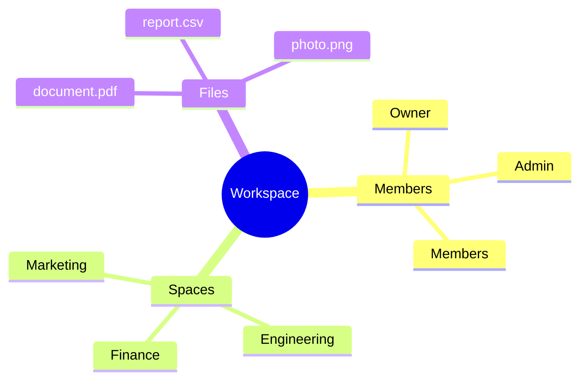
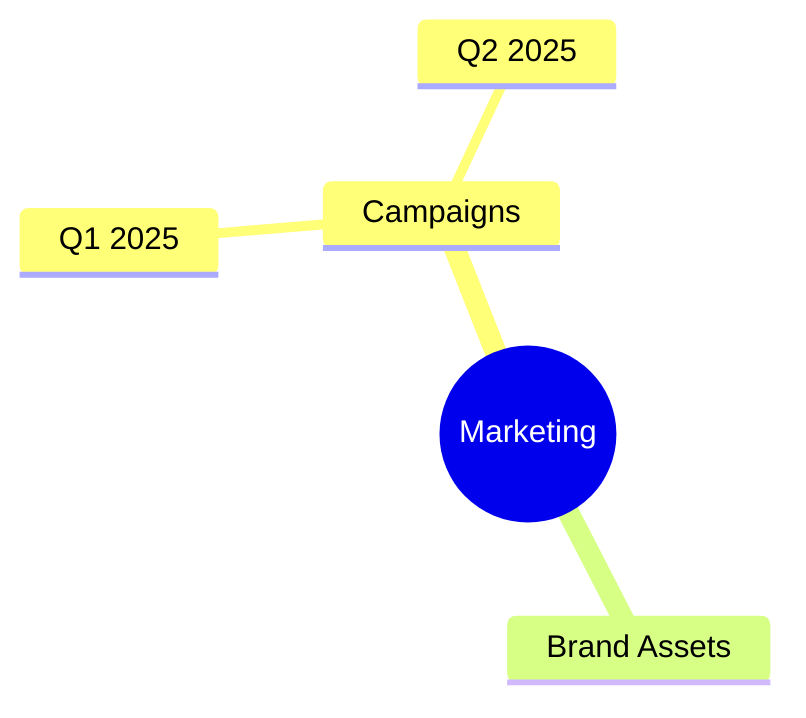
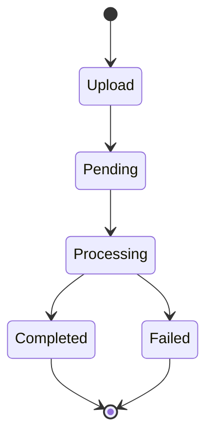
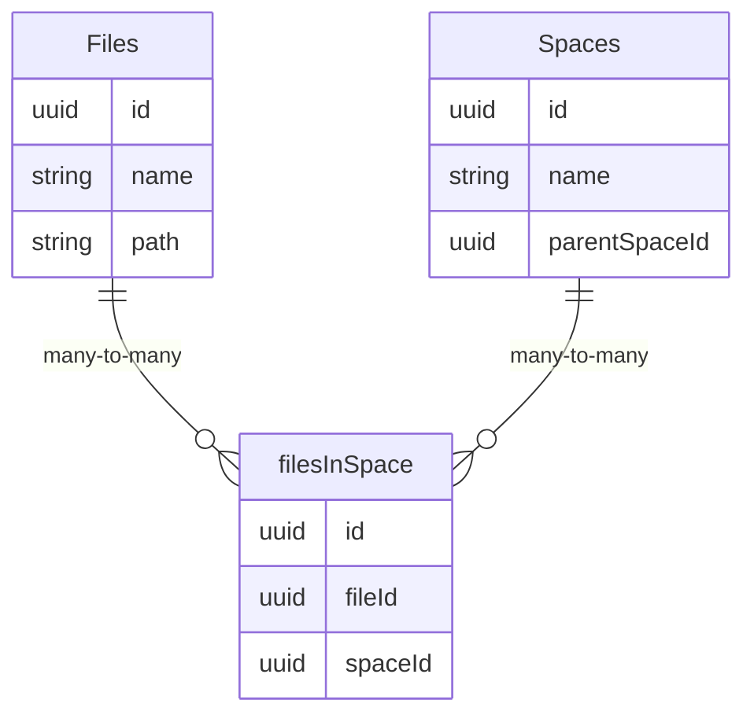
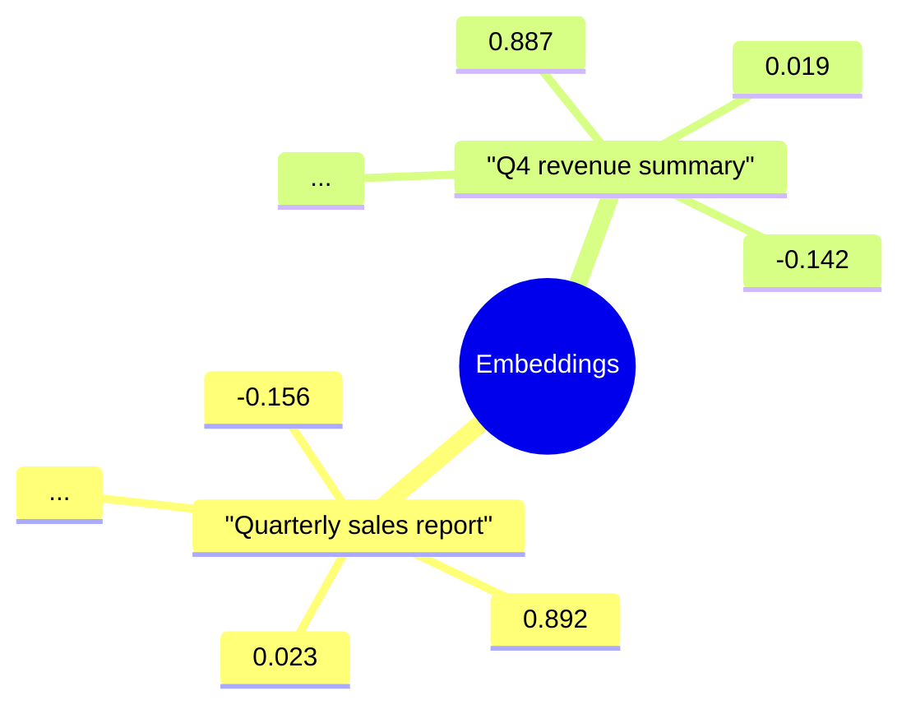
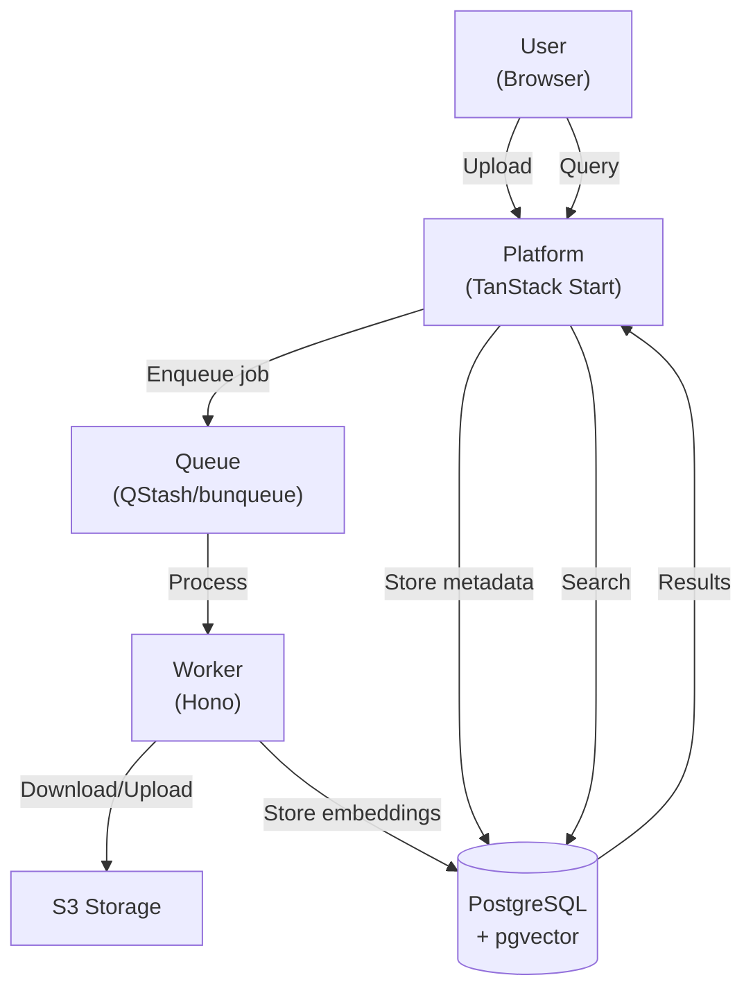

Understanding Curiositi's core concepts will help you make the most of the platform.

## Workspaces

Workspaces are the top-level containers in Curiositi. They represent teams or companies.

### Key Features

- **Multi-tenancy** — Each workspace is completely isolated
- **Member Management** — Invite users with different roles (owner, admin, member)
- **Session Scoping** — Users select an active workspace, and all queries are scoped to it

### Workspace Structure

```mermaid
mindmap
  root((Workspace))
    Members
      Owner
      Admin
      Members
    Spaces
      Marketing
      Engineering
      Finance
    Files
      document.pdf
      report.csv
      photo.png
```

### Workspace Data Model

Workspaces are stored as `organization` records in the database (via Better Auth):

| Field | Type | Description |
|-------|------|-------------|
| `id` | text | Primary key |
| `name` | text | Workspace name |
| `slug` | text | URL-friendly identifier (unique) |
| `logo` | text | Optional logo URL |
| `metadata` | text | Optional metadata |
| `createdAt` | timestamp | Creation time |

### Workspace Roles

Workspaces support role-based access through the `organizationRoles` table:

| Field | Type | Description |
|-------|------|-------------|
| `id` | text | Primary key |
| `organizationId` | text | Reference to workspace |
| `role` | text | Role name |
| `permission` | text | Permission granted to this role |
| `createdAt` | timestamp | Creation time |
| `updatedAt` | timestamp | Last modification time |

### Invitations

Users can be invited to workspaces via the `invitation` table:

| Field | Type | Description |
|-------|------|-------------|
| `id` | text | Primary key |
| `email` | text | Invitee email address |
| `inviterId` | text | Reference to inviting user |
| `organizationId` | text | Reference to workspace |
| `role` | text | Role to assign |
| `status` | text | Invitation status |
| `createdAt` | timestamp | Creation time |
| `expiresAt` | timestamp | Expiration time |

## Spaces

Spaces are Curiositi's way of organizing content. They work like folders with hierarchical nesting.

### Space Hierarchy

Spaces can be nested using the `parentSpaceId` field:

```mermaid
mindmap
  root((Marketing))
    Campaigns
      Q1 2025
      Q2 2025
    Brand Assets
```

### Space Data Model

| Field | Type | Description |
|-------|------|-------------|
| `id` | UUID | Primary key (auto-generated) |
| `name` | text | Display name |
| `description` | text | Optional description |
| `icon` | text | Optional icon (e.g., emoji) |
| `organizationId` | text | Owning workspace |
| `parentSpaceId` | UUID / null | Parent space reference for nesting |
| `createdAt` | timestamp | Creation time |
| `updatedAt` | timestamp | Last modification time |

### Spaces vs Traditional Folders

| Feature | Traditional Folders | Curiositi Spaces |
|---------|---------------------|------------------|
| Nesting | Limited depth | Unlimited hierarchy |
| Search | Filename only | Semantic search across all content |
| File location | Files in one folder | Files can be in multiple spaces |
| Organization scope | Per-user | Per-workspace |

## Files

Files are the core content in Curiositi. Each file goes through a processing pipeline from upload to searchable content.

### File Lifecycle

```mermaid
stateDiagram-v2
    [*] --> Upload
    Upload --> Pending
    Pending --> Processing
    Processing --> Completed
    Processing --> Failed
    Completed --> [*]
    Failed --> [*]
```

### File Statuses

| Status | Description |
|--------|-------------|
| `pending` | File uploaded, waiting for worker to process |
| `processing` | Worker is extracting content and generating embeddings |
| `completed` | File is fully processed and searchable |
| `failed` | Processing encountered an error |

### File Data Model

| Field | Type | Description |
|-------|------|-------------|
| `id` | UUID | Primary key (auto-generated) |
| `name` | text | Original filename |
| `path` | text | S3 storage path |
| `size` | integer | File size in bytes |
| `type` | text | MIME type |
| `organizationId` | text | Owning workspace |
| `uploadedById` | text | User who uploaded the file |
| `status` | enum | `pending`, `processing`, `completed`, `failed` |
| `tags` | jsonb | Optional tags (default: `{ tags: [] }`) |
| `processedAt` | timestamp | When processing completed |
| `createdAt` | timestamp | Upload time |
| `updatedAt` | timestamp | Last modification time |

### File Processing Pipeline

When a file is uploaded:

1. **Upload** — File streams to S3 storage
2. **Metadata** — File record created in database with status `pending`
3. **Queue** — Processing job dispatched via Upstash QStash or bunqueue
4. **Content Extraction** — Worker extracts text based on file type:
   - **PDF, text, markdown, HTML, CSV, JSON, XML**: Direct text extraction
   - **Word (.docx)**: mammoth library extraction with AI fallback
   - **Word (.doc)**: AI-powered extraction
   - **Excel (.xlsx)**: Sheet-aware extraction with header-aware chunking
   - **Excel (.xls)**: AI-powered extraction
   - **PowerPoint (.pptx)**: Slide text extraction with AI fallback
   - **PowerPoint (.ppt)**: AI-powered extraction
   - **Images**: AI vision model generates description
5. **Chunking** — Content split into chunks (300 tokens, 60 token overlap) with context prefix (file name, type, page numbers, section titles)
6. **Embedding** — Each chunk converted to a 1536-dimension vector
7. **Storage** — Chunks and embeddings saved to `fileContents` table
8. **Complete** — File status updated to `completed`

## Content Chunks

Files are broken into chunks for precise semantic search.

### Why Chunking?

- **Precision** — Find the exact relevant section, not just the file
- **Context** — Overlapping chunks preserve context across boundaries
- **Token Limits** — Fits within embedding model constraints
- **Performance** — Smaller vectors enable faster similarity search

### Chunk Data Model (fileContents table)

| Field | Type | Description |
|-------|------|-------------|
| `id` | UUID | Primary key (auto-generated) |
| `fileId` | UUID | Reference to parent file |
| `content` | text | The text content of the chunk |
| `embeddedContent` | vector(1536) | Vector embedding for similarity search |
| `metadata` | json | Optional metadata about the chunk |
| `createdAt` | timestamp | Creation time |
| `updatedAt` | timestamp | Last modification time |

### Chunking Parameters

- **Chunk size:** 300 tokens
- **Overlap:** 60 tokens

Each chunk also includes a context prefix with metadata (file name, file type, page numbers, section titles, CSV headers) prepended to the content before embedding. This improves search relevance by providing contextual signals alongside the raw text.

## The Junction Pattern

Files can exist in multiple spaces simultaneously using the `filesInSpace` junction table.

### Many-to-Many Relationship

```mermaid
erDiagram
    Files ||--o{ filesInSpace : "many-to-many"
    Spaces ||--o{ filesInSpace : "many-to-many"

    Files {
        uuid id
        string name
        string path
    }

    Spaces {
        uuid id
        string name
        uuid parentSpaceId
    }

    filesInSpace {
        uuid id
        uuid fileId
        uuid spaceId
    }
```

### filesInSpace Data Model

| Field | Type | Description |
|-------|------|-------------|
| `id` | UUID | Primary key |
| `fileId` | UUID | Reference to file |
| `spaceId` | UUID | Reference to space |
| `createdAt` | timestamp | When the link was created |
| `updatedAt` | timestamp | Last modification time |

### Benefits

- No file duplication in storage
- Single source of truth for file content and embeddings
- Flexible organization — add a file to any number of spaces
- Easy reorganization without moving data

## Agents and Conversations

Curiositi supports intelligent agentic workflows, enabling you to converse with your data and perform actions via chat.

### Agents
Agents are AI entities powered by LLMs (e.g., OpenAI, Anthropic, Google, Ollama) configured with specific system prompts and tool access limits. They exist within a workspace and can use various tools to fulfill requests.

### Agent Data Model

| Field | Type | Description |
|-------|------|-------------|
| `id` | UUID | Primary key (auto-generated) |
| `name` | text | Agent display name |
| `description` | text | Optional description |
| `organizationId` | text | Owning workspace |
| `createdById` | text | User who created the agent |
| `systemPrompt` | text | System prompt for the agent |
| `maxToolCalls` | integer | Maximum tool calls per conversation turn (default: 10) |
| `isDefault` | boolean | Whether this is the default agent |
| `isActive` | boolean | Whether the agent is active |
| `createdAt` | timestamp | Creation time |
| `updatedAt` | timestamp | Last modification time |

### System Agents

Curiositi provides two built-in system agents:

| Agent | ID | Description | Max Tool Calls |
|-------|----|-------------|---------------|
| Ask | `system:ask` | General-purpose assistant for everyday questions | 10 |
| Deep Research | `system:deep-research` | Thorough research agent that explores topics in depth | 100 |

### Tools and MCP
Tools expand an agent's capabilities:
- **Built-in Tools**: Foundational actions available to agents:
  - **File Search (`fileSearch`)**: Semantic search across uploaded documents and files
  - **Web Search (`webSearch`)**: Search the web using Firecrawl for current information
  - **Web Fetch (`webFetch`)**: Fetch and extract content from a specific URL
- **Model Context Protocol (MCP)**: Curiositi integrates with MCP servers to bring external capabilities, data, and context directly to your agents without custom integrations.

### Tool Data Model

| Field | Type | Description |
|-------|------|-------------|
| `id` | UUID | Primary key |
| `toolKey` | text | Unique key identifier (e.g., `fileSearch`, `webSearch`) |
| `name` | text | Internal name |
| `displayName` | text | Human-readable name |
| `description` | text | Tool description |
| `type` | enum | `builtin` or `mcp` |
| `mcpServerId` | UUID / null | Reference to MCP server (for MCP tools) |
| `organizationId` | text | Owning workspace |
| `config` | jsonb | Tool configuration (default: `{}`) |
| `isActive` | boolean | Whether the tool is active |
| `createdAt` | timestamp | Creation time |
| `updatedAt` | timestamp | Last modification time |

### Agent-Tool Junction (agentTools)

| Field | Type | Description |
|-------|------|-------------|
| `id` | UUID | Primary key |
| `agentId` | UUID | Reference to agent |
| `toolId` | UUID | Reference to tool |
| `enabled` | boolean | Whether the tool is enabled for this agent |
| `priority` | integer | Tool priority (default: 0) |
| `config` | jsonb | Agent-specific tool configuration |
| `createdAt` | timestamp | Creation time |

### Conversations
Conversations capture the interactions (messages and tool call context) between users and an agent, providing a persistent history of queries and analysis.

### Conversation Data Model

| Field | Type | Description |
|-------|------|-------------|
| `id` | UUID | Primary key |
| `externalId` | text / null | External identifier (unique) |
| `title` | text / null | Conversation title |
| `source` | enum | `web` or `slack` |
| `organizationId` | text | Owning workspace |
| `createdById` | text | User who started the conversation |
| `metadata` | jsonb / null | Optional metadata |
| `createdAt` | timestamp | Creation time |
| `updatedAt` | timestamp | Last modification time |

### Message Data Model

| Field | Type | Description |
|-------|------|-------------|
| `id` | UUID | Primary key |
| `conversationId` | UUID | Reference to conversation |
| `role` | enum | `user`, `assistant`, `system`, or `tool` |
| `content` | text | Message content |
| `attachments` | jsonb / null | File attachments |
| `toolCalls` | jsonb / null | Tool call data |
| `tokenCount` | integer / null | Token usage count |
| `costUSD` | numeric / null | Cost in USD |
| `agentId` | UUID / null | Reference to agent (set null on agent deletion) |
| `metadata` | jsonb / null | Optional metadata |
| `createdAt` | timestamp | Creation time |

### MCP Servers

MCP servers provide external tools and context to agents:

| Field | Type | Description |
|-------|------|-------------|
| `id` | UUID | Primary key |
| `name` | text | Server display name |
| `url` | text | MCP server endpoint URL |
| `headers` | jsonb / null | Custom headers for authentication |
| `headersEncrypted` | text / null | Encrypted headers |
| `isActive` | boolean | Whether the server is active |
| `organizationId` | text | Owning workspace |
| `discoveredTools` | integer | Number of tools discovered (default: 0) |
| `lastConnectedAt` | timestamp / null | Last successful connection time |
| `createdAt` | timestamp | Creation time |
| `updatedAt` | timestamp | Last modification time |

### Organization Settings

Workspace-level settings are stored in the `organizationSettings` table:

| Field | Type | Description |
|-------|------|-------------|
| `id` | UUID | Primary key |
| `organizationId` | text | Reference to workspace |
| `key` | text | Setting key |
| `value` | jsonb | Setting value |
| `updatedAt` | timestamp | Last modification time |

## Semantic Search

The heart of Curiositi is semantic search — finding files by meaning, not just keywords.

### How It Works

1. **Query Embedding** — Your search text is converted to a 1536-dimension vector
2. **Similarity Search** — pgvector finds the closest matching content chunks using cosine similarity
3. **Ranking** — Results ranked by similarity score
4. **Aggregation** — Matching chunks grouped by source file
5. **Response** — Files returned with relevance scores

### Vector Embeddings

Curiositi uses 1536-dimension embeddings:

```mermaid
mindmap
  root((Embeddings))
    "Quarterly sales report"
      0.023
      -0.156
      0.892
      ...
    "Q4 revenue summary"
      0.019
      -0.142
      0.887
      ...
```

## Authentication and Authorization

Curiositi uses Better Auth for authentication.

### Supported Methods

- **Email/Password** — Standard credential-based login
- **Google OAuth** — Sign in with Google

### Session Management

Sessions are stored in PostgreSQL. Each session tracks the user's active workspace (via `activeOrganizationId`), which scopes all subsequent queries.

### Permission Model

| Role | Capabilities |
|------|-------------|
| Owner | Full control, member management |
| Admin | Create spaces, upload files, manage content |
| Member | Upload files, search, read access |

## Data Flow

How data moves through Curiositi:

```mermaid
flowchart TB
    User["User<br/>(Browser)"] -->|"Upload"| Platform["Platform<br/>(TanStack Start)"]
    Platform -->|"Enqueue job"| Queue["Queue<br/>(QStash/bunqueue)"]
    Platform -->|"Store metadata"| DB[(PostgreSQL<br/>+ pgvector)]
    Queue -->|"Process"| Worker["Worker<br/>(Hono)"]
    Worker -->|"Download/Upload"| S3["S3 Storage"]
    Worker -->|"Store embeddings"| DB
    User -->|"Query"| Platform
    Platform -->|"Search"| DB
    DB -->|"Results"| Platform
```

## Next Steps

- [Uploading Files](/docs/features/uploading-files) — Learn the file upload process
- [AI Search](/docs/features/ai-search) — Master semantic search
- [Spaces](/docs/features/spaces) — Organize your content
