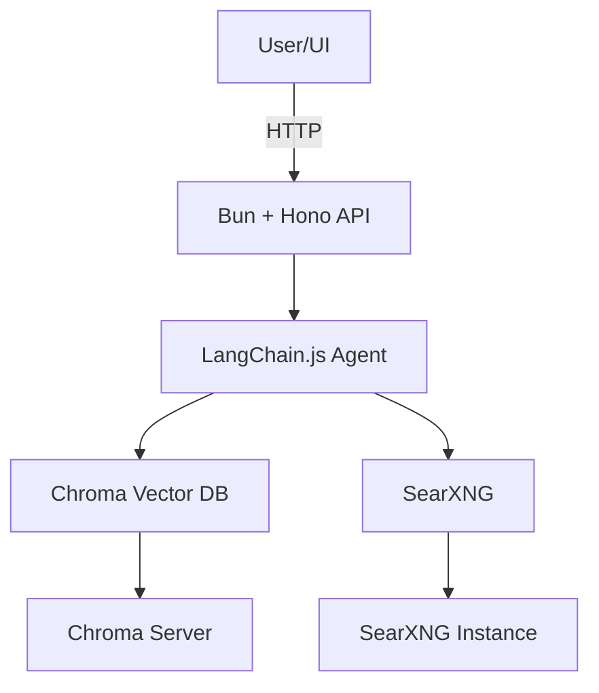

## Summary

This Product Requirements Document (PRD) outlines the vision, scope, and detailed requirements for **Curiositi**, an agentic AI assistant that blends hybrid web and document search via LangChain.js, Chroma, SearXNG, and a Bun+Hono backend, with integrations to Notion (MCP) and Google Drive, targeting an MVP in v1 and a market-ready product by v3. The document aligns stakeholders on objectives, user needs, features, technical architecture, and success metrics, ensuring all teams share a common blueprint for development and launch.

---

## 1. Purpose & Scope

**1.1 Purpose**

Curiositi enables users to ask natural-language questions that are answered by synthesizing information from both personal documents (via Chroma vector search) and the live web (via SearXNG), orchestrated by a LangChain.js agent running on a high-performance Bun+Hono backend.

**1.2 Scope**

- **In-scope for v1**: PDF/Text upload, Ollama embeddings, Chroma-based RAG, SearXNG web search, basic React UI, Hono+Bun API endpoints.
- **Out-of-scope for v1**: Multi-LLM fallback, enterprise RBAC, billing, plugin marketplace (reserved for v2/v3).

---

## 2. Background

Organizations and individuals struggle to unify insights from static personal documents and the dynamic web; traditional search tools lack semantic understanding across these sources. A PRD ensures teams align on solving this problem space by defining clear product goals and requirements.

---

## 3. Goals & Objectives

1. **MVP Delivery (v1)**: Launch core hybrid-RAG chat functionality within 6 weeks, achieving ≤2 s average query latency and ≥80 % user satisfaction on answer relevance.
2. **Enhanced Integration (v2)**: Add Notion (MCP) and Google Drive connectors, hybrid semantic+keyword retrieval, and basic analytics by week 16.
3. **Market Readiness (v3)**: Implement multi-LLM support, plugin system, RBAC, billing, and SLA 99.9 % by week 40.

---

## 4. User Personas

| Persona              | Description                          | Needs                                                |
| -------------------- | ------------------------------------ | ---------------------------------------------------- |
| **Knowledge Worker** | Researcher with scattered PDFs, docs | Unified semantic search across files & web.          |
| **Product Manager**  | Coordinates specs in Notion/Drive    | Quick answers with source citations, versioned docs. |
| **Developer**        | Builds on CLI/REST APIs              | Streamable JSON responses, extensible tools.         |

---

## 5. User Stories

1. **As a Knowledge Worker**, I can upload a PDF so that I can query its contents semantically.
2. **As a PM**, I can connect my Notion workspace via MCP to surface project docs in chat.
3. **As a Developer**, I can call a REST `/chat` endpoint to integrate Curiositi into my app.
4. **As a User**, I can see which source (doc vs web) each answer came from for trust.

---

## 6. Functional Requirements

### 6.1 Document Ingestion

- **FR1**: `/upload` endpoint accepts PDF/TXT, splits into ≤500-token chunks.
- **FR2**: Generate embeddings via Ollama/OpenAI and store in Chroma vector DB.

### 6.2 Web Search

- **FR3**: Integrate SearXNG tool in LangChain agent for real-time snippet retrieval.

### 6.3 Agent Orchestration

- **FR4**: LangChain.js agent routes between `doc_search` and `web_search` tools based on query classification.
- **FR5**: Stream responses token-by-token over SSE in `/chat` endpoint.

### 6.4 Integrations (v2)

- **FR6**: OAuth-based Notion MCP connector fetching pages & databases.
- **FR7**: Google Drive API connector with folder/file selection.

---

## 7. Non-Functional Requirements

- **NFR1 Performance**: ≤300 ms average tool-call latency, ≤2 s end-to-end response time under typical load.
- **NFR2 Scalability**: Support horizontal scaling via Bun's edge deployments.
- **NFR3 Security**: Encrypt embeddings at rest; secure API keys via environment bindings.
- **NFR4 Observability**: LangSmith traces for each agent decision; Prometheus metrics for endpoint latencies.

---

## 8. Technical Architecture

- **Backend**: Bun runtime, Hono routing, TypeScript.
- **Agent**: LangChain.js with Ollama LLM & embeddings.
- **Storage**: Chroma for vectors, optional Redis cache.

---

## 9. Milestones & Roadmap

| Phase         | Duration | Deliverables                                                    |
| ------------- | -------- | --------------------------------------------------------------- |
| **v1 (MVP)**  | 6 wks    | Core `/upload`, `/chat`, Chroma, SearXNG, basic UI.             |
| **v2 (MMP)**  | +10 wks  | Notion/Drive connectors, hybrid retriever, analytics dashboard. |
| **v3 (Prod)** | +24 wks  | Multi-LLM, plugin system, RBAC, billing, hardening.             |

---

## 10. Success Metrics

- **Adoption**: ≥100 active users by end of v2.
- **Quality**: ≥4.2/5 average user rating on answer relevance.
- **Performance**: p95 response time ≤3 s.
- **Reliability**: 99.9 % API uptime.

---

## 11. Risks & Mitigations

| Risk                      | Impact         | Mitigation                                         |
| ------------------------- | -------------- | -------------------------------------------------- |
| LLM hallucinations        | Misinformation | Add verifier chain; display citations prominently. |
| API rate limits (SearXNG) | Downtime       | Implement caching; fallback to doc-only mode.      |
| Scaling Chroma            | Latency spikes | Shard vector DB; use Redis cache.                  |

---

## 12. Appendices

- **A. Glossary**: RAG, LLM, MCP, SSE.
- **B. API Contracts**: OpenAPI spec for `/chat`, `/upload`, `/tools/doc-search`.
- **C. References**: All cited PRD templates and best-practice guides.
